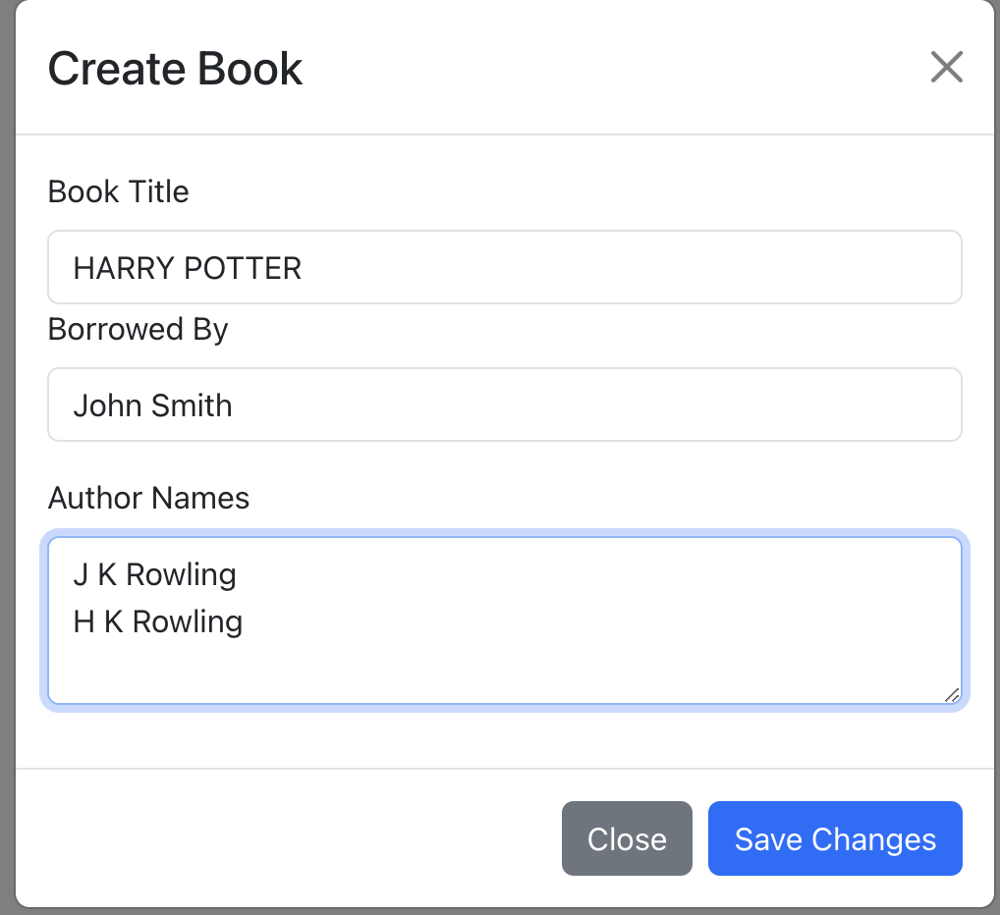
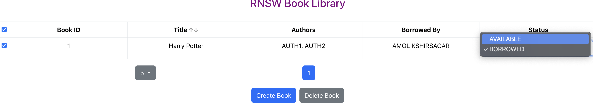

A) **Steps to run the project in default profile**
- **Step 1**: Clone the repository shared(using the command given)
  **"git clone https://github.com/amolksagar/book-library.git"**

- **Step 2**:
  cd to the book-library folder.
  Execute the command
  **npm start**

- **Step 3**:
  Please make sure the backend application is launched as per the instructions provided in the README.md file of the booklibrary spring boot application
  The react application is launched at http://localhost:3000/
  
- Important points:
    - Functionalities
        - A few Books have been added on backend application context load so that the book library is not empty initially.
        - Create Book: Persists a Book record into the backend H2 DB via the spring boot application
            - Each Book can have multiple authors.Hence a text area has been provided where you can enter multiple Authors each on a new line as shown below
                - 
        - Delete Book: Deletes the persisted Book record
        - The Update Book status works as shown below.Double click on the particular cell that you want to change and continue with other operations
          The update API will be called onBlur event
            - 